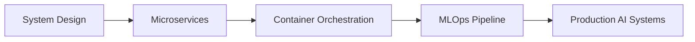

<div align="center">


<br/>

<!-- Animated separator -->


## 🚀 About Me

<table>
<tr>
<td width="50%">

### 🎯 Current Focus
- 🧠 **Deep diving into LLMs & GenAI**
- 🏗️ **Architecting scalable full-stack solutions**
- 📚 **CS @ VIT-AP University**
- 🌍 **Based in Andhra Pradesh, India**

### 💡 What Drives Me
- **Innovation** through AI-powered applications
- **Problem-solving** with elegant code
- **Learning** emerging technologies
- **Building** products that matter

</td>
<td width="50%">

### 🏆 Quick Stats
```text
🎓 Computer Science Student
🤖 AI/ML Enthusiast  
👨‍💻 Full-Stack Developer
🚀 Hackathon Winner
📝 Research Publication Author
👥 Community Leader (300+ students)
```

### 🎯 2025 Goals
- [ ] Master System Design patterns
- [ ] Contribute to open source

</td>
</tr>
</table>


</div>

## 🛠️ Technology Stack

<div align="center">

### 💻 Programming Languages


### 🎨 Frontend Development


### ⚡ Backend Development


### 🤖 AI/ML & Data


### ☁️ Cloud & DevOps


### 🗄️ Databases


</div>

<br/>

<div align="center">

</div>

## 🚀 Featured Projects

<div align="center">

<table>
<tr>
<td width="50%">
<h3 align="center">🧠 LifeSync AI</h3>
<div align="center">  
<a href="https://github.com/Pranav-Rayaprolu/lifesync-ai" target="_blank">

</a>
</div>
<p align="center">


</p>
<p align="center">A contextually-aware personal AI assistant that maintains conversation history and learns from user interactions. Features advanced memory management and natural language processing.</p>
</td>

<td width="50%">
<h3 align="center">📝 Meeting Summarizer</h3>
<div align="center">  
<a href="https://github.com/Pranav-Rayaprolu/meeting-summarizer" target="_blank">

</a>
</div>
<p align="center">


</p>
<p align="center">AI-powered tool that transforms lengthy meeting recordings into concise, actionable summaries. Includes speaker identification and key point extraction.</p>
</td>
</tr>

<tr>
<td width="50%">
<h3 align="center">🤖 InterviewBot</h3>
<div align="center">  
<a href="https://github.com/Pranav-Rayaprolu/interviewbot" target="_blank">

</a>
<a href="https://doi.org/your-paper-link" target="_blank">

</a>
</div>
<p align="center">


</p>
<p align="center">Published research project on AI-driven interview simulation system. Featured adaptive questioning and real-time performance analysis.</p>
</td>

<td width="50%">
<h3 align="center">🌐 Portfolio Website</h3>
<div align="center">  
<a href="https://portfolio-pied-theta-79.vercel.app/" target="_blank">

</a>
</div>
<p align="center">


</p>
<p align="center">Modern, responsive portfolio showcasing projects and skills. Features smooth animations, dark mode, and optimized performance.</p>
</td>
</tr>
</table>

</div>

<br/>

<div align="center">

</div>

## 🏆 Achievements & Recognition

<div align="center">

<table>
<tr>
<td align="center" width="33%">
<h3>🥇 Hackathons</h3>
<p><strong>Top 5%</strong> at HackOn with Amazon</p>
<p><strong>Winner</strong> at InnovateTech 2024</p>
<p><strong>Finalist</strong> in AI/ML Track</p>

</td>
<td align="center" width="33%">
<h3>📄 Research</h3>
<p><strong>Published</strong> InterviewBot Paper</p>
<p><strong>Conference Presentation</strong></p>
<p><strong>Peer Review</strong> Process</p>

</td>
<td align="center" width="33%">
<h3>👥 Leadership</h3>
<p><strong>CSI Coordinator</strong></p>
<p>Led <strong>300+ students</strong></p>
<p><strong>Event Organization</strong></p>

</td>
</tr>
</table>

### 🎖️ Certifications Obtained  


</div>

<br/>

<div align="center">

</div>

## 📊 GitHub Analytics

<div align="center">


<br/>

<!-- GitHub Contribution Snake -->


### 📈 Contribution Stats


</div>

<br/>

<div align="center">

</div>

## 🌱 Currently Learning & Exploring

<div align="center">

<table>
<tr>
<td width="50%" align="center">
<h3>🎯 Tech Focus Areas</h3>
<br/>


</td>
<td width="50%" align="center">
<h3>📚 Learning Resources</h3>
<br/>
<p>🎓 <strong>System Design Interview</strong> by Alex Xu</p>
<p>🤖 <strong>Generative AI with LangChain</strong></p>
<p>☁️ <strong>AWS Solutions Architecture</strong></p>
<p>🔧 <strong>Docker & Kubernetes Deep Dive</strong></p>
<p>📊 <strong>MLOps Best Practices</strong></p>
</td>
</tr>
</table>

### 🎯 2025 Learning Roadmap


</div>

<br/>

<div align="center">

</div>

## 🤝 Let's Connect & Collaborate

<div align="center">

<p>💬 <strong>Open to discussing:</strong> AI/ML projects, Full-stack development, System design, Hackathons, Research collaborations</p>

<br/>

<a href="https://portfolio-pied-theta-79.vercel.app/" target="_blank">

</a>
<a href="https://linkedin.com/in/pranav-rayaprolu" target="_blank">

</a>
<a href="mailto:pranavrayaprolu108@gmail.com" target="_blank">

</a>
<br/><br/>


</div>

<br/>

<div align="center">

**💭 "The future belongs to those who believe in the beauty of their dreams." - Eleanor Roosevelt**

<br/>

*✨ Thanks for visiting my profile! Feel free to explore my repositories and don't hesitate to reach out for collaborations or just a friendly chat about tech! ✨*

<br/>


</div>
